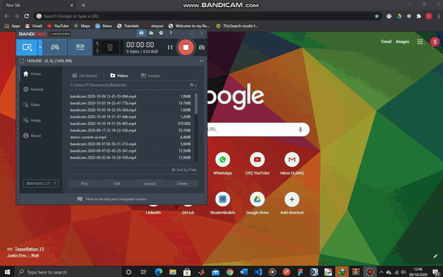

# PLANT-DISEASE-CLASSIFIER-WEB-APP-TENSORFLOWJS

Tools and Technologies used 😇:-

1. Tensorflow (for training the model in Google colab)
2. Tensorflow.js (Embedding the model for client-side/browser inference)
3. Javascript
4. Python
5. HTML and CSS

Video Demonstration 😇 :- 

You can access the project online <a href="https://rexsimiloluwah.github.io/PLANT-DISEASE-CLASSIFIER-WEB-APP-TENSORFLOWJS/">HERE</a> 

